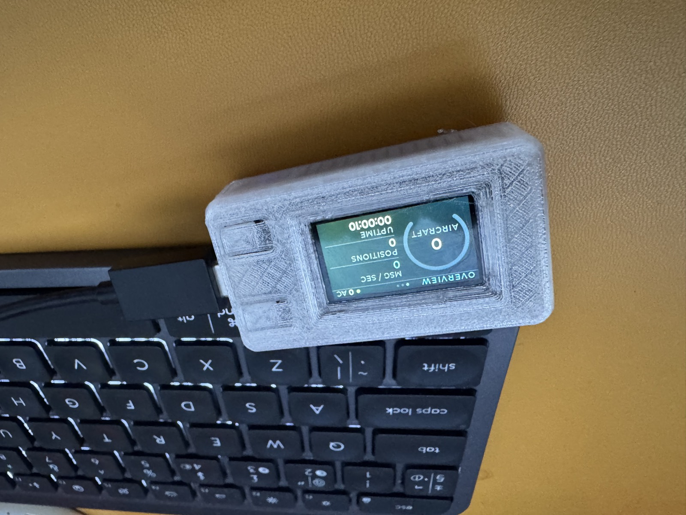
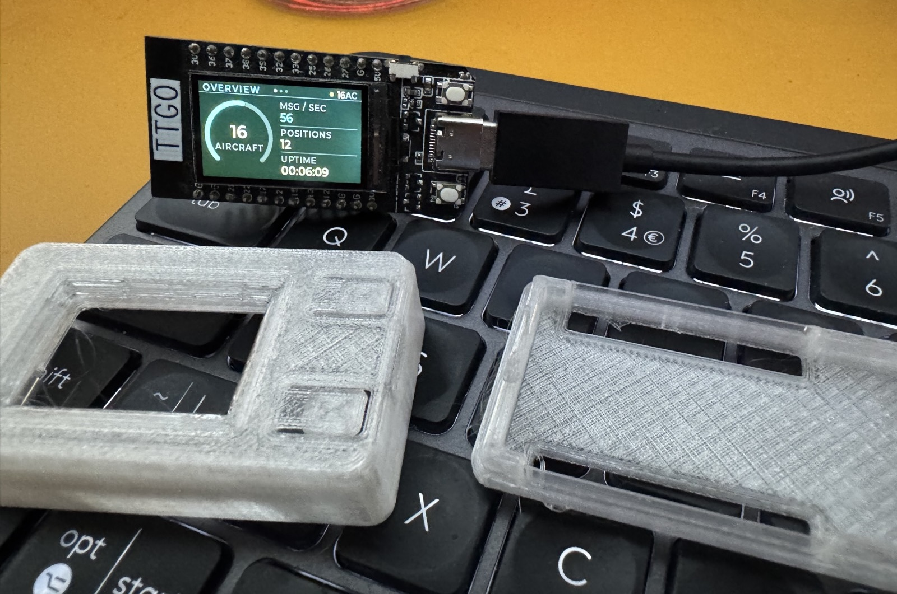
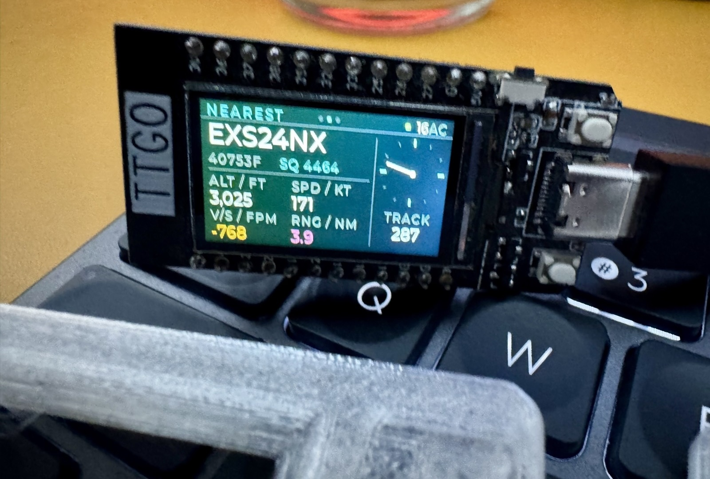
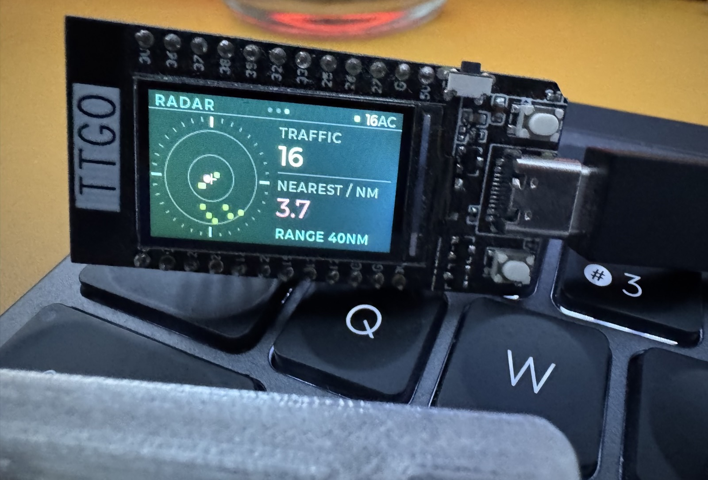

# ttgo-fr24

An ADS-B traffic display for the LilyGO/TTGO T-Display (ESP32 + 240×135 ST7789),
driven by a local dump1090 / readsb receiver over the SBS-1 BaseStation feed.


Each panel above is one full screen at 240×135, shown at 3×. These are not
photographs or drawings — they come straight out of [the host renderer](#the-host-renderer),
which runs the real LVGL over the same `src/ui.c` that ships to the board, so
they are what the panel displays, pixel for pixel. The traffic is seeded
(Loganair and easyJet being the local operators at Glasgow).

And the same thing on the bench, in a printed case:



| Overview | Nearest | Radar |
| --- | --- | --- |
|  |  |  |

Three pages, changed with the two on-board buttons:

| Page | Shows |
| --- | --- |
| **Overview** | Aircraft count in a ring gauge, message rate, positions decoded, uptime |
| **Nearest** | Closest contact — callsign, ICAO hex, squawk, altitude, ground speed, vertical rate, range, and a track rose |
| **Radar** | Plan view — compass rose, range rings, traffic plotted by range and bearing from the antenna |

Colours follow the Boeing/Airbus Navigation Display convention rather than
being invented: cyan for data and scale annotation, **magenta for the selected
target** (so the nearest aircraft is magenta on both the radar and its own
page), green for other traffic, white for headline values, and amber reserved
for things that actually warrant attention — feed down, RSSI below −70 dBm, a
descending aircraft, or a 7500/7600/7700 squawk.

## Hardware

- LilyGO T-Display ESP32 ([board notes](https://done.land/components/microcontroller/families/esp/esp32/developmentboards/esp32s/t-display/))
- 240×135 ST7789, landscape (rotation 1)
- Top button `GPIO0` pages forward, bottom button `GPIO35` pages back

`GPIO35` is input-only with no internal pull-up — it relies on the board's
on-board one, so `pinMode(BTN_PREV, INPUT)` is deliberate.

### Case

Printed with [this T-Display enclosure](https://www.printables.com/model/119144-lilygo-ttgo-t-display-enclosure)
from Printables — a two-part shell that leaves both buttons and the USB-C port
accessible, which is all this project needs from a case.

A note on what you'll see in the flesh: the T-Display is a transmissive IPS
panel with an edge-lit backlight, so its black is really "backlight minus what
the pixels block". The near-black `#05090C` ground reads as an uneven teal-blue
wash on the real screen rather than the true black the renderer draws. The
colour *values* are identical — the renderer is accurate about geometry and
what each pixel is set to, not about how this particular panel physically
shows black.

## Data source

The receiver's SBS-1 feed on TCP port 30003: unauthenticated, plaintext CSV,
one message per line. No API key or login needed. Confirm yours is up with:

```bash
nc your-receiver-host 30003
```

Messages arrive sparsely when traffic is light — long gaps are normal and are
not a fault.

## Build and flash

PlatformIO does everything. If you don't have it, a project-local venv avoids
fighting your system Python (macOS ships an externally-managed one that
refuses `pip install`):

```bash
python3 -m venv .pio-venv && .pio-venv/bin/pip install platformio
```

Then configure and flash:

```bash
cp include/secrets.h.example include/secrets.h
```

Fill in your WiFi, your receiver's host, and the antenna's latitude/longitude —
range and bearing are computed from that position, so an approximate one gives
approximate answers.

```bash
.pio-venv/bin/platformio run -t upload
```

`include/secrets.h` is gitignored. Keep it that way.

## Control panel

The device runs a small HTTP server with a live settings and stats page —
find it from the serial log at boot, or at `http://squawk.local/` if your
network resolves mDNS:

```
Control panel: http://172.22.203.176 (or http://squawk.local/)
```

The top half is read-only: link status, aircraft tracked, message rate, the
page currently showing, backlight level, and the nearest contact — polled
every two seconds, which is plenty for numbers that change once a second at
most. The bottom half is every setting in the table below, editable and
saved to flash (NVS) on submit — no reflash, and the change survives a
reboot. A stray-click-proof "reset to defaults" restores the `config.h`
values.

It's a plain [`WebServer`](https://github.com/espressif/arduino-esp32/tree/master/libraries/WebServer)
instance, already linked in via the WiFi framework, polled rather than
pushed over a websocket — indistinguishable at a 2-second cadence, and it
adds no library weight on a board that's already most of the way through its
flash. There's no authentication: anyone on the same network can change
settings, same as the SBS-1 feed it reads from.

## Configuration

Everything below has a compile-time default in
[`include/config.h`](include/config.h), which is committed — only
credentials and the antenna position are kept out of the repo. `config.h` is
only read once, into NVS, on a device's very first boot; after that, edit
values from the [control panel](#control-panel) instead of reflashing.

| Setting | Default | What it does |
| --- | --- | --- |
| `FEED_SILENCE_MS` | 30 s | Reconnect if nothing arrives from the receiver for this long |
| `FEED_RECONNECT_MS` | 5 s | Minimum gap between connection attempts |
| `AIRCRAFT_STALE_MS` | 60 s | Drop an aircraft not heard from for this long |
| `AUTO_CYCLE` | 1 | Cycle the pages on a timer; 0 for manual paging only |
| `PAGE_DWELL_MS` | 10 s | How long each page is shown when cycling |
| `MANUAL_HOLD_MS` | 30 s | Automation stands down for this long after a button press |
| `PRIORITY_ENABLE` | 1 | Pin the Nearest page when a contact is close |
| `PRIORITY_RANGE_NM` | 5.0 | Range that triggers the pin |
| `PRIORITY_HYST_NM` | 0.5 | Dead band before the pin releases again |
| `SCOPE_RANGE_NM` | 40 | Outer range ring on the radar page |
| `DIM_ENABLE` | 1 | Dim the backlight after dark |
| `DIM_DAY_PCT` | 100 | Backlight level while the sun's up |
| `DIM_NIGHT_PCT` | 50 | Backlight level after dark |

Four behaviours are worth understanding before you tune them.

**The backlight follows the sun, not a clock.** Sunrise and sunset are
computed from the antenna's lat/lon in `secrets.h` against NTP time — the
device syncs over WiFi at boot, so it needs a network path to
`pool.ntp.org` at least once. Until it has synced, the backlight sits at
`DIM_DAY_PCT`; the panel's "NTP clock" stat shows whether it has. The
transition is a hard cut at sunrise/sunset, not a fade, and it's re-checked
every 30 seconds — the sun doesn't move fast enough to need more.

**The reconnect is a half-open socket fix.** When the receiver goes away, this
end keeps reporting `connected()` — a TCP peer's disappearance is invisible
until you write to the socket, and the device only ever reads. Silence is the
sole symptom available, so a gap longer than `FEED_SILENCE_MS` is treated as a
dead link and the connection is torn down and rebuilt. The trade-off:
dump1090 sends nothing at all when it is tracking no aircraft, so on a quiet
night the link will recycle on a timer. Harmless, but raise the threshold if
it bothers you.

**Button presses win.** Any press suspends both the cycle and the proximity
pin for `MANUAL_HOLD_MS`, so the page cannot be pulled out from under you
while you are reading it.

**The proximity pin has hysteresis.** It engages at `PRIORITY_RANGE_NM` but
only releases at `PRIORITY_RANGE_NM + PRIORITY_HYST_NM`. Without that dead
band an aircraft loitering on the boundary would flap the page back and forth
every update.

## The host renderer

`sim/` compiles the real LVGL against a memory framebuffer, runs the same
`src/ui.c` that ships to the device, and writes PNGs at exactly 240×135 in
RGB565 — same library, same fonts, same colour depth as the panel:

```bash
./sim/build.sh
```

Output lands in `sim/out/`: each page on its own at 1:1, plus a 3× contact
sheet of all three side by side. About four seconds, no board required.

This exists because mocking up an LVGL UI in HTML validates nothing — it only
encodes what you assumed the library does. Rendering it for real caught several
bugs that reasoning had not, and cut the design loop from a flash cycle to a
few seconds. `src/ui.c` is deliberately free of Arduino headers so both targets
compile it unchanged; `include/lv_conf.h` switches its tick source on
`SQUAWK_SIM`.

To try an edge case — no traffic, an emergency squawk, an over-long callsign —
edit the seed table in `sim/main.c` and re-render.

## LVGL 8.4 notes

Things worth knowing, all of them found the hard way:

- **Never call `lv_obj_remove_style_all()` on a tileview tile.**
  `lv_tileview_add_tile` positions tiles with `lv_obj_set_pos`/`set_size`,
  which are *local styles* in LVGL 8 — removing them stacks every page at
  x=0. The tileview's own geometry and padding must also be final *before*
  any tile is added, since the constructor reads its content size then.
- **`lv_meter` unconditionally draws a number at every major tick**, which is
  meaningless on a compass. Suppress with
  `lv_obj_set_style_text_opa(m, LV_OPA_TRANSP, LV_PART_TICKS)` — ticks are
  drawn from a separate line descriptor and survive.
- **Major ticks must divide onto the cardinals.** With `tickCnt-1` intervals
  over 360°, the major interval is `(tickCnt-1)/4`. Reusing one constant
  across roses with different tick counts silently loses E and S.
- **`%f` in `lv_label_set_text_fmt` needs `LV_SPRINTF_USE_FLOAT 1`**, or the
  format string is emitted literally.
- **`pushColors(..., swap = true)`** when bridging LVGL to `TFT_eSPI`, or the
  RGB565 byte order is wrong and every colour is scrambled.
- **PlatformIO does not put the project's `include/` on the path for library
  sources.** `-D` flags reach them but `-I` does not, so `lv_conf.h` is
  invisible to LVGL's own files until you add `-I include` to `build_flags`.
- Montserrat line heights are 12→15px, 16→18px, 20→22px, 24→27px, and an
  uppercase glyph at 12px runs about 8px wide — which puts a hard ceiling of
  roughly 8 characters on a caption in a 120px column.

## Layout

```
src/ui.c          the whole UI, pure LVGL, no platform headers
include/ui.h      the model struct the UI renders from
src/main.cpp      WiFi, SBS-1 parsing, aircraft table, buttons, ESP32 glue
src/settings.*    runtime settings, persisted to NVS
src/suntime.*     NTP sync, sunrise/sunset, backlight PWM
src/webpanel.*    the HTTP control panel
sim/              host renderer
include/lv_conf.h
platformio.ini
```

A 16px header sits on the screen *outside* the tileview, carrying the page
name, a link LED, the aircraft count and a page indicator. Keeping it there
rather than duplicating it into each tile means no tile is ever wide enough to
let its neighbour bleed in at the screen edge.
